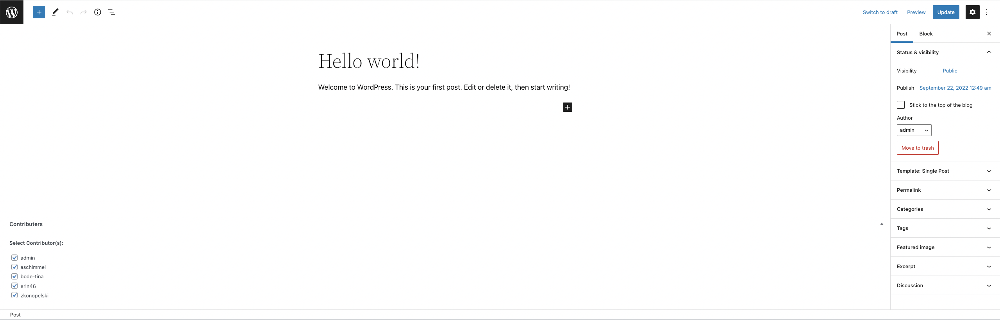
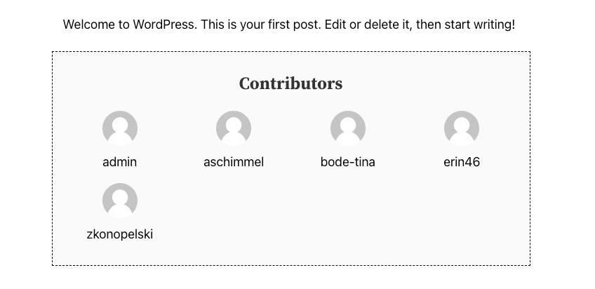

# Wordpress Contributors Plugin

## About the Plugin
Through this plugin you will be able to assign multiple contributors to a single blog post. On the admin post edit page there will be a metabox named **Contributors**, that will showing the list of users having _Administrator_, _Author_, _Editor_, or _Contributor_ role. You can select one or more contributors from the list just by checking the checkboxes assigned to the users. Selet the contributors by checking the checkboxes and save the post. Once post is saved or published, visit/view the post and you will see the contributors at the bottom of the post content along with their avatar images.

## Demo Images

#### Back-End View

#### Front-End View

## How to install this plugin in WordPress website
Follow the following steps to install the plugin.
1. You need to go to WordPress admin area and visit **Plugins » Add** New page.
2. After that, click on the ‘Upload Plugin’ button on top of the page, you will see the plugin upload form.
3. Click on the ‘Choose File’ button and select the plugin file you downloaded earlier to your computer.
4. After you have selected the file, you need to click on the ‘Install Now’ button.

_WordPress will now upload the plugin file from your computer and install it for you. You will see a success message like this after the installation is finished._

## License
This project is licensed under the MIT License.

## Author
[Muhammad Ibrar](https://profiles.wordpress.org/ibrar1991/)